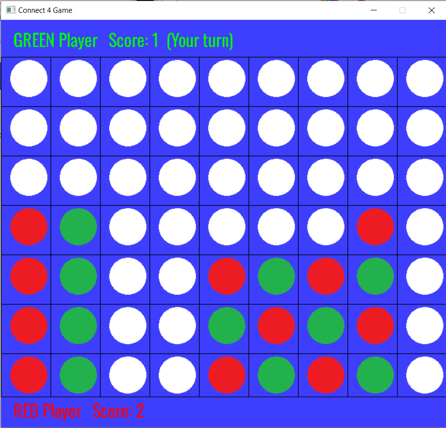

# Connect4-Game-with-GUI

### This is a connected 4 game with GUI made with C Programming Language. I used SDL2 for the GUI.

## Play The Game

To play the game go to the **./Connected4_Game/bin/Release/** folder then open **Connected4_Game.exe** and you are ready to play.

## End Game

The game ends when the board is full (Not with the first connected 4). Every connected 4 disks is counted as 1 score.

## Game Features

There is two modes in the game **(Human vs Human)** and **(Human vs Computer)**. There is a **high score** board. You can save up to 3 games. You can change the dimensions of the game and the number of players in the high score by changing the **config.xml** file in the **Data** Folder. When the game ends, The game will ask the winner to write his name to add it to the high score board. The time spent playing will be printed to the screen.

## User Manual

You can undo moves up to the first move using the **left arrow (<-)** from the keyboard. You can redo the moves using the **right arrow (->)** from the keyboard. You can save the game by pressing **S** from the keyboard or by closing the game. You can return to the main menu by pressing **Esc** from the keyboard.

## Sample Runs

### The Main Menu
  
### The Game Play
  
### The Winning Page

<h1>اى الجمداااان والعظمه يا غالى<h1>
  <h2>متقبلش البول ريكويست العبيط ده بقا +بحبك فى الله والله <h2>
